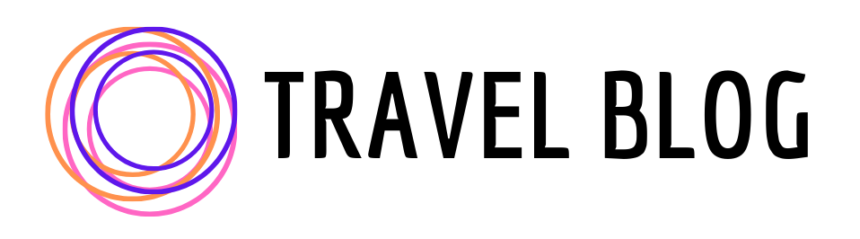

<p align="center">
  <a href="#">
    
  </a>
  <br/>
  
 </p>
 

<p align="center">
Personal blog for public sharing travel experience and memories</p>
<br>

## Project Overview

Personal blog gives an amazing opportunity help other people through sharing travel experience. It inspires an audience for getting similar emotions from visited parts of the world and change their lives for the better. 

It also provides a great way for meeting like minded people. Through sharing common interests, it is easier to make friends.


## Preview
<center>
  
</center>


## Main Features & Architectural Notes
- :hammer_and_wrench: Built with **Next.js** framework
- :paintbrush: Designed with :heart: and **Adobe XD**
- :art: Responsive design styled with **Sass** 
- :memo: Content served with **Contentful** headless CMS
- :world_map: Map is served with **Google Maps API**
- :date: Dates are formatted with **moment.js**

## Getting Started

```bash
git clone https://github.com/felistter/travel-blog.git
cd travel-blog 
npm install
npm next dev 
```

## License

Licensed under the MIT License.

